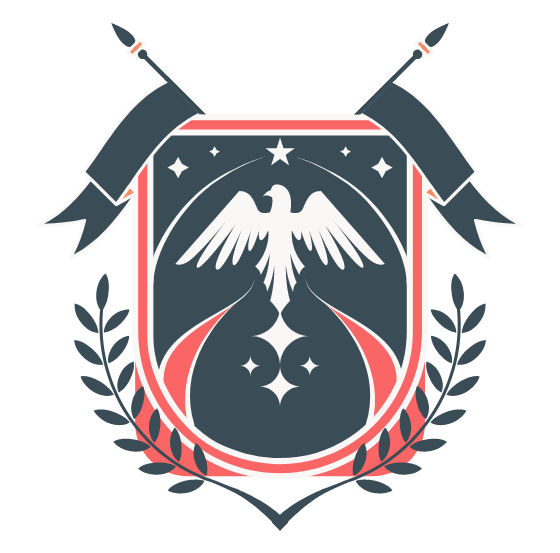

<!-- REPLACE ALL THE [laracassandra] TEXT WITH YOUR GITHUB PROFILE NAME & THE [knight-university] WITH THE NAME OF YOUR GITHUB PROJECT -->

<!-- Repository Information & Links-->
<br />


[![LinkedIn][linkedin-shield]][linkedin-url]
<!-- [![Instagram][instagram-shield]][instagram-url]
[![Behance][behance-shield]][behance-url] -->

<!-- HEADER SECTION -->
<h5 align="center" style="padding:0;margin:0;">Lara Cook</h5>
<h5 align="center" style="padding:0;margin:0;">190218</h5>
<h6 align="center">IDV303</h6>
</br>
<p align="center">

  <a href="https://github.com/laracassandra/knight-university">
    
  </a>
  
  <h3 align="center">Knight University Administration</h3>

  <p align="center">
    Desktop administration application for Knight University<br>
      <a href="https://github.com/laracassandra/knight-university"><strong>Explore the docs »</strong></a>
   <br />
   <br />
   <a href="path/to/demonstration/video">View Demo</a>
    ·
    <a href="https://github.com/laracassandra/knight-university/issues">Report Bug</a>
    ·
    <a href="https://github.com/laracassandra/knight-university/issues">Request Feature</a>
</p>
<!-- TABLE OF CONTENTS -->
## Table of Contents

- [Table of Contents](#table-of-contents)
- [About the Project](#about-the-project)
  - [Project Description](#project-description)
  - [Built With](#built-with)
- [Getting Started](#getting-started)
  - [Prerequisites](#prerequisites)
  - [How to install](#how-to-install)
  - [Installation](#installation)
- [Features and Functionality](#features-and-functionality)
  - [Dashboard Design](#dashboard-design)
  - [Feature 2](#feature-2)
  - [Feature 2](#feature-2-1)
- [Concept Process](#concept-process)
  - [Ideation](#ideation)
  - [Wireframes](#wireframes)
  - [Entity Relationship Diagram](#entity-relationship-diagram)
- [Development Process](#development-process)
  - [Implementation Process](#implementation-process)
    - [Highlights](#highlights)
    - [Challenges](#challenges)
  - [Future Implementation](#future-implementation)
- [Final Outcome](#final-outcome)
  - [Mockups](#mockups)
  - [Video Demonstration](#video-demonstration)
- [Roadmap](#roadmap)
- [Contributing](#contributing)
- [Authors](#authors)
- [License](#license)
- [Contact](#contact)
- [Acknowledgements](#acknowledgements)

<!--PROJECT DESCRIPTION-->
## About the Project
<!-- header image of project -->
![image1][image1]

### Project Description

Knight University's system became to large to manage and needed to move their administration system to an computer program to help them manage the system. Through this, Knight University Administration was born.

### Built With

* [Kotlin](https://kotlinlang.org/)
* [TornadoFX](https://tornadofx.io/)
* [InteliiJ IDEA](https://www.jetbrains.com/idea/)
* [Github](https://github.com/)

<!-- GETTING STARTED -->
<!-- Make sure to add appropriate information about what prerequesite technologies the user would need and also the steps to install your project on their own mashines -->
## Getting Started

The following instructions will get you a copy of the project up and running on your local machine for development and testing purposes.

### Prerequisites

Ensure that you have the latest version of [IntelliJ Idea Community Version](https://www.jetbrains.com/idea/download/#section=windows) installed on your machine. The [Kotlin](https://plugins.jetbrains.com/plugin/6954-kotlin) plugin will also be required.

### How to install

### Installation
Here are a couple of ways to clone this repo:

1. Software </br>
`IntelliJ Idea` -> `File` -> `New` -> `From Version Control`</br>
Enter `https://github.com/laracassandra/knight-university.git` into the URL field and press the `Clone` button.

1. Clone Repository </br>
Run the following in the command-line to clone the project:
   ```sh
   git clone https://github.com/laracassandra/knight-university.git
   ```
    Open `IntelliJ Idea` and select `File | Open...` from the menu. Select cloned directory

<!-- FEATURES AND FUNCTIONALITY-->
<!-- You can add the links to all of your imagery at the bottom of the file as references -->
## Features and Functionality

![image2][image2]
### Dashboard Design

Simplistic, dashboard to 

![image3][image3]
### Feature 2

Description of Feature

![image4][image4]
### Feature 2

Description of Feature

<!-- CONCEPT PROCESS -->
<!-- Briefly explain your concept ideation process -->
## Concept Process

The `Conceptual Process` is the set of actions, activities and research that was done when starting this project.

### Ideation

![image5][image5]
<br>

### Wireframes

![image6][image6]

### Entity Relationship Diagram

![image7][image7]

<!-- DEVELOPMENT PROCESS -->
## Development Process

The `Development Process` is the technical implementations and functionality done in the frontend and backend of the application.

### Implementation Process
<!-- stipulate all of the functionality you included in the project -->

* Made use of both `functionality` to implement a specific feature.
* `MVC/MVVM` design architecture implemented.
* `Plugin` for this.
* ETC.

#### Highlights
<!-- stipulated the highlight you experienced with the project -->
* Sunshine.
* Rainbows.

#### Challenges
<!-- stipulated the challenges you faced with the project and why you think you faced it or how you think you'll solve it (if not solved) -->
* Bugs.
* Bugs.

### Future Implementation
<!-- stipulate functionality and improvements that can be implemented in the future. -->

* Future 1.
* Future 2.

<!-- MOCKUPS -->
## Final Outcome

### Mockups

![image8][image8]
<br>
![image9][image9]

<!-- VIDEO DEMONSTRATION -->
### Video Demonstration

To see a run through of the application, click below:

[View Demonstration](path/to/video/demonstration)

<!-- ROADMAP -->
## Roadmap

See the [open issues](https://github.com/laracassandra/knight-university/issues) for a list of proposed features (and known issues).

<!-- CONTRIBUTING -->
## Contributing

Contributions are what makes the open-source community such an amazing place to learn, inspire, and create. Any contributions you make are **greatly appreciated**.

1. Fork the Project
2. Create your Feature Branch (`git checkout -b feature/AmazingFeature`)
3. Commit your Changes (`git commit -m 'Add some AmazingFeature'`)
4. Push to the Branch (`git push origin feature/AmazingFeature`)
5. Open a Pull Request

<!-- AUTHORS -->
## Authors

* **Lara Cook** - [laracassandra](https://github.com/laracassandra)

<!-- LICENSE -->
## License

Distributed under the MIT License. See `LICENSE` for more information.\

<!-- LICENSE -->
## Contact

* **Lara Cook** - [larac.cook@gmail.com](mailto:larac.cook@gmail.com) 
* **Project Link** - https://github.com/laracassandra/knight-university

<!-- ACKNOWLEDGEMENTS -->
## Acknowledgements
<!-- all resources that you used and Acknowledgements here -->
* Lecturer: Christof Enslin
* [TornadoFX guide](https://edvin.gitbooks.io/tornadofx-guide/content/)
* [Kotlin documentation](https://kotlinlang.org/docs/home.html)
* [Freepik](https://freepik.com/)
* [FlatIcon](https://flaticon.com/)


<!-- MARKDOWN LINKS & IMAGES -->
[image1]: Images/image-1.png
[image2]: Images/image-2.png
[image3]: Images/image-3.png
[image4]: Images/image-4.png
[image5]: Images/image-5.png
[image6]: Images/image-6.png
[image7]: Images/image-7.png
[image8]: Images/image-8.png
[image9]: Images/image-9.png


<!-- Refer to https://shields.io/ for more information and options about the shield links at the top of the ReadMe file -->
[linkedin-shield]: https://img.shields.io/badge/-LinkedIn-black.svg?style=flat-square&logo=linkedin&colorB=555
[linkedin-url]: https://www.linkedin.com/in/nameonlinkedin/
[instagram-shield]: https://img.shields.io/badge/-Instagram-black.svg?style=flat-square&logo=instagram&colorB=555
[instagram-url]: https://www.instagram.com/instagram_handle/
[behance-shield]: https://img.shields.io/badge/-Behance-black.svg?style=flat-square&logo=behance&colorB=555
[behance-url]: https://www.behance.net/name-on-behance/
